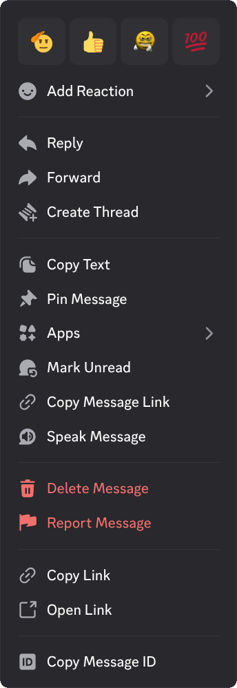
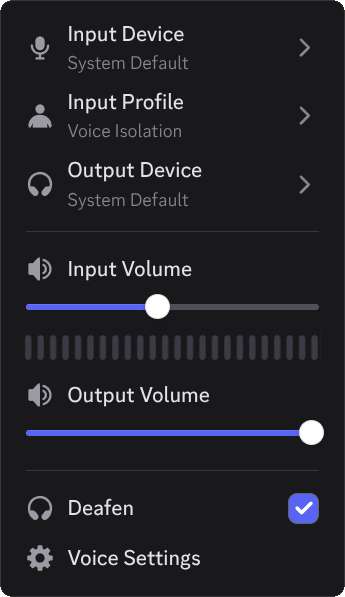
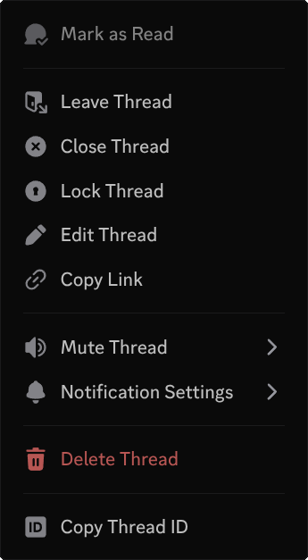
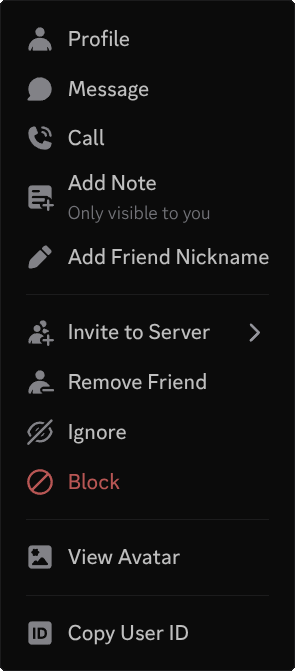

# Context Menu Icons

Adds icons to context menus for Vencord.

|  |  |  |  |
| ------------------------------------------ | ------------------------------------------ | ---------------------------------------------- | ----------------------------------------------- |
| Text | Voice | Thread | User |

## Installation

### QuickCSS

1. Paste the following code at the top of your QuickCSS file:

   ```css
   @import url("https://raw.githubusercontent.com/924e50c0/ContextMenuIcons/refs/heads/main/ContextMenuIcons.theme.css");
   ```

2. Variables:

   ```css
   :root {
   --cmiSIZE: 18px;               /* icon size */
   --cmiGAPx: 2;                  /* gap multiplier between icon & text*/
   }
   ```

### Local

1. Download `ContextMenuIcons.theme.css`:
   - [GitHub](https://github.com/924e50c0/ContextMenuIcons/releases/download/v1.1.0/ContextMenuIcons.theme.css)
2. Place the file in the themes folder:
   - `Settings` > `Vencord` > `Themes` > `Local Themes` > `Open Themes Folder`
3. Click `Load missing Themes` and toggle on the theme card.

### Online

1. Paste the link in `Settings` > `Vencord` > `Themes` > `Online Themes`:
   - `https://raw.githubusercontent.com/924e50c0/ContextMenuIcons/main/ContextMenuIcons.theme.css`

## Changelog

- [2025-12-25](https://github.com/924e50c0/ContextMenuIcons/commit/0970abf8b441539606ab8a80f6fc3dd574325ce9) - add missing icons, experiments submenu & guild settings submenu support
- [2025-12-24](https://github.com/924e50c0/ContextMenuIcons/commit/c6c0fe862dfa87d3fcf82535474ff5637680e1ab) - complete rewrite with new icons & more readable code. as a result many icons are reused, some are missing & plugin support has been deprecated for the time being

## To-do list

- Add plugin support
- Add missing icons
- Add missing menus (Events, settings submenus)
- Remove any missed unplanned or undone menu

## Credits

- Discord
- [Vencord](https://github.com/Vendicated/Vencord) by [Vendicated](https://github.com/Vendicated)
- [Material Symbols](https://github.com/google/material-design-icons) by [Google](https://github.com/google)
