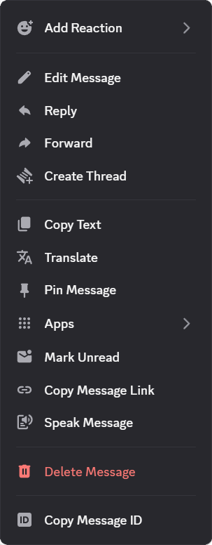

# Context Menu Icons

Adds icons to context menus for Vencord.

|  |     |    |    |
| --------------------------------------- | ---------------------------------------- | ------------------------------------------ | ------------------------------------------ |
| Server actions                          | User actions                             | Channel actions                            | Message actions                            |

## Installation

### Local

1. Download `ContextMenuIcons.theme.css`:

- [GitHub](https://github.com/924e50c0/ContextMenuIcons/releases/download/v0.1.0-alpha/ContextMenuIcons.theme.css)

2. Place the file in the themes folder:

- `Settings` > `Vencord` > `Themes` > `Local Themes` > `Open Themes Folder`

3. Click `Load missing Themes` and toggle on the theme card.

### Online

1. Paste the link in `Settings` > `Vencord` > `Themes` > `Online Themes`:
   `https://raw.githubusercontent.com/924e50c0/ContextMenuIcons/main/ContextMenuIcons.theme.css`
