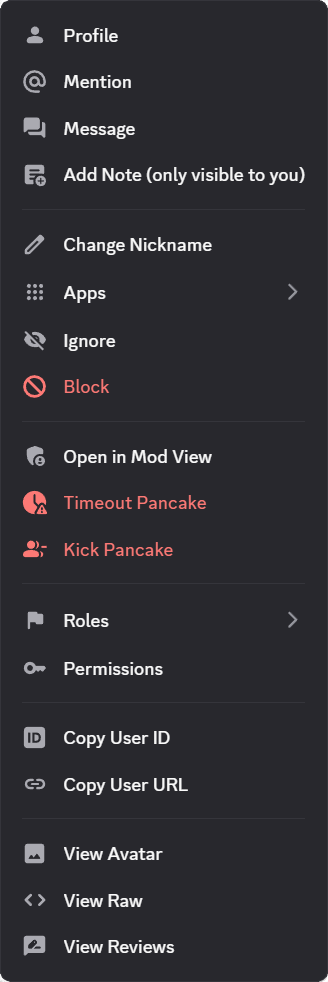
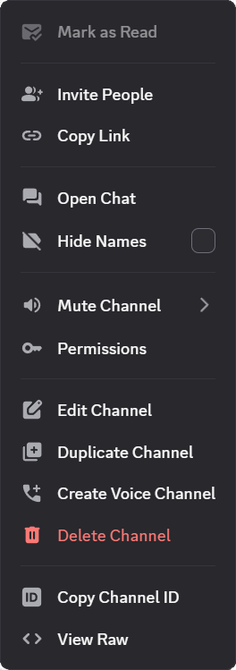

# Context Menu Icons

Adds icons to context menus for Vencord.

|  |  |  |  |
| ------------------------------------- | --------------------------------------- | ---------------------------------------- | ---------------------------------------- |
| User actions                          | Server actions                          | Channel actions                          | Message actions                          |

## Installation

### Local

1. Download `ContextMenuIcons.theme.css`:

   - [GitHub](https://github.com/924e50c0/ContextMenuIcons/releases/download/v1.0.0/ContextMenuIcons.theme.css)

2. Place the file in the themes folder:

   - `Settings` > `Vencord` > `Themes` > `Local Themes` > `Open Themes Folder`

3. Click `Load missing Themes` and toggle on the theme card.

### Online

1. Paste the link in `Settings` > `Vencord` > `Themes` > `Online Themes`:
   - `https://raw.githubusercontent.com/924e50c0/ContextMenuIcons/main/ContextMenuIcons.theme.css`

## Credits

- [SettingsIcon](https://github.com/MiniDiscordThemes/SettingsIcons) by [Saltssaumure](https://github.com/Saltssaumure)
  - Server settings submenu
  - User panel settings submenu

- Discord
  - [Thread icon](https://github.com/924e50c0/ContextMenuIcons/blob/main/svg/thread.svg)
  - [Create thread icon](https://github.com/924e50c0/ContextMenuIcons/blob/main/svg/create_thread.svg)
  - [Poll icon](https://github.com/924e50c0/ContextMenuIcons/blob/main/svg/poll.svg)

- [Vencord](https://github.com/Vendicated/Vencord) by [Vendicated]()
  - [Notification log icon](https://github.com/924e50c0/ContextMenuIcons/blob/main/svg/vencord_notifications_log.svg)
  - [Edit quick css icon](https://github.com/924e50c0/ContextMenuIcons/blob/main/svg/vencord_edit_quickcss.svg)

- [Material Symbols](https://github.com/google/material-design-icons) by [Google](https://github.com/google)
  - Everything else
